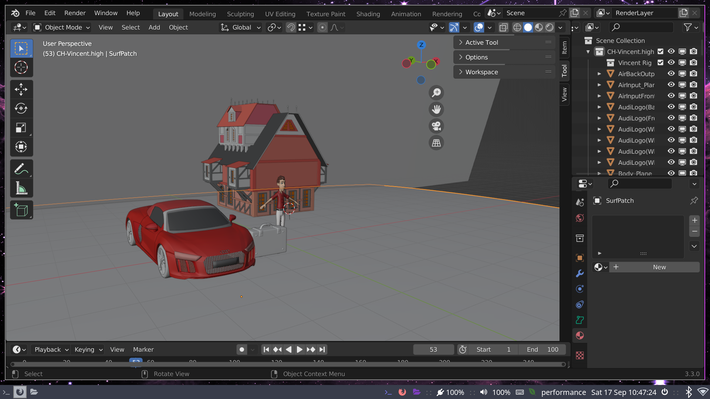

# AR-BLENDER
This is Excercise 1 of AR-VR course at SRM IST.
All the code and assets used in this project is open source

## Installation
```bash
pacman -S blender
```

**Note:** This project is only tested on Arch Linux
* Run the vincent.blend file

## Description
* Added new vincent with red tshirt and white pants.
* Added a new medieval house
* Added a new modern car

## Contribution Guidelines
```
1. Fork the repository
2. Clone the repository
3. Create a new branch
4. Make changes
5. Commit and push
6. Create a pull request
```

## Demo:


## License
Distributed under the MIT License. See `LICENSE` for more information.